# Loan Approval Prediction using XGBoost

## 📖 Project Story: Why This Matters?
Loan approvals play a crucial role in financial stability, helping individuals and businesses achieve their goals. However, banks and financial institutions need a **robust predictive model** to assess creditworthiness and minimize risks. This project tackles this challenge using **XGBoost**, one of the most powerful machine learning algorithms for structured data. Our goal? To **predict loan approvals with high accuracy**, leveraging **extensive Exploratory Data Analysis (EDA) and feature importance techniques** to gain deep insights.

---

## 📊 Exploratory Data Analysis (EDA)
Before building our predictive model, we conducted a thorough **EDA** to uncover trends, distributions, and relationships between variables. Here are the key visual insights:

### 1️⃣ Loan Amount Distribution
A histogram showcasing the distribution of loan amounts, revealing common loan ranges and outliers.

<p align="center">
  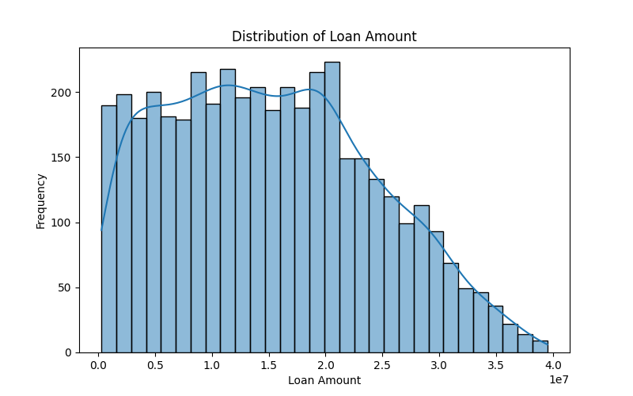
</p>

### 2️⃣ Loan Status Distribution (Approved vs. Rejected)
A count plot visualizing the proportion of approved and rejected loans, helping us understand class imbalances.

<p align="center">
  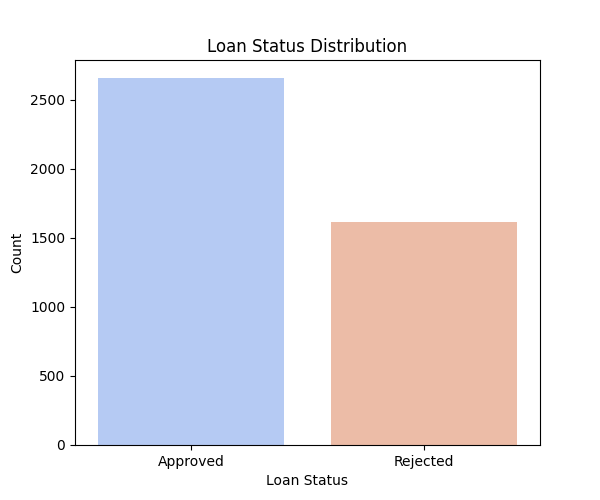
</p>

### 3️⃣ Income vs. Loan Amount (Scatter Plot)
A scatter plot depicting how annual income influences loan amounts, highlighting risk patterns.

<p align="center">
  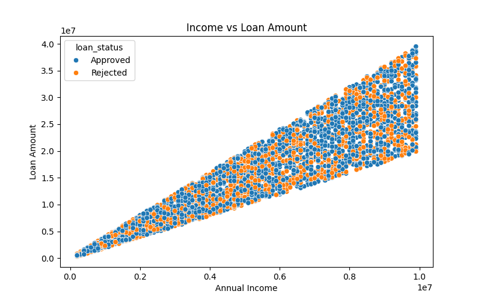
</p>

### 4️⃣ CIBIL Score Distribution
A histogram showing the distribution of **CIBIL scores**, which is a key factor in loan approvals.

<p align="center">
  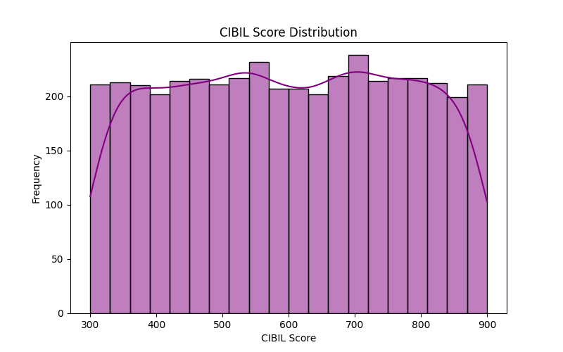
</p>

### 5️⃣ Loan Term Distribution
A histogram to analyze how loan terms vary across applications, indicating typical repayment periods.

<p align="center">
  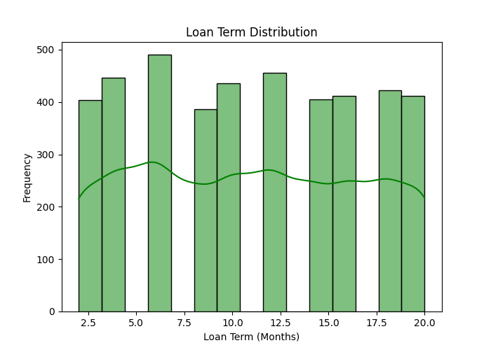
</p>

### 6️⃣ Self-Employment vs. Loan Status
A bar chart showing whether self-employed individuals have higher rejection rates.

<p align="center">
  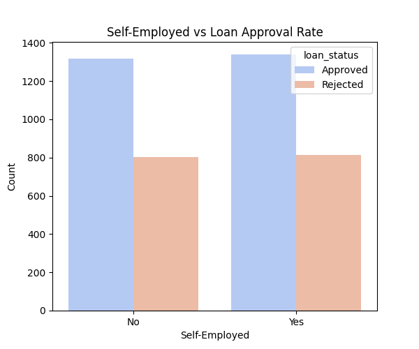
</p>

### 7️⃣ Education Level Impact
A visualization comparing loan approval rates across different education levels.

<p align="center">
  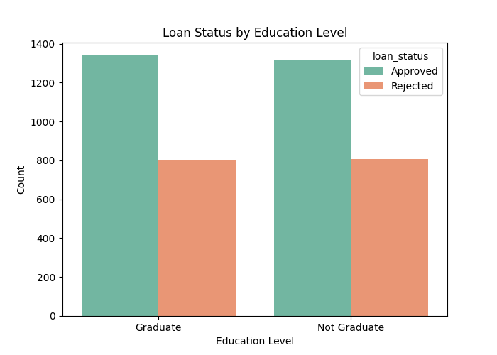
</p>

### 8️⃣ Feature Correlation Heatmap
A correlation heatmap revealing how different features interact, helping us select the most predictive variables.

<p align="center">
  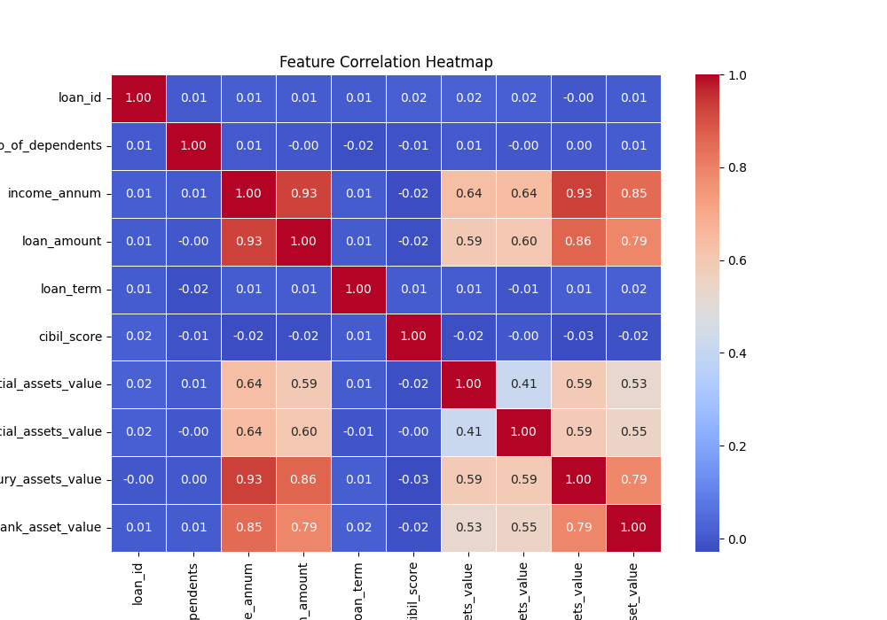
</p>

### 9️⃣ Loan Amount by Loan Status
A boxplot showing how loan amounts differ for approved vs. rejected applications.

<p align="center">
  
</p>

### 🔟 Pairplot of Key Features
A pairplot showing the relationships between major features like income, loan amount, CIBIL score, and loan term.

<p align="center">
  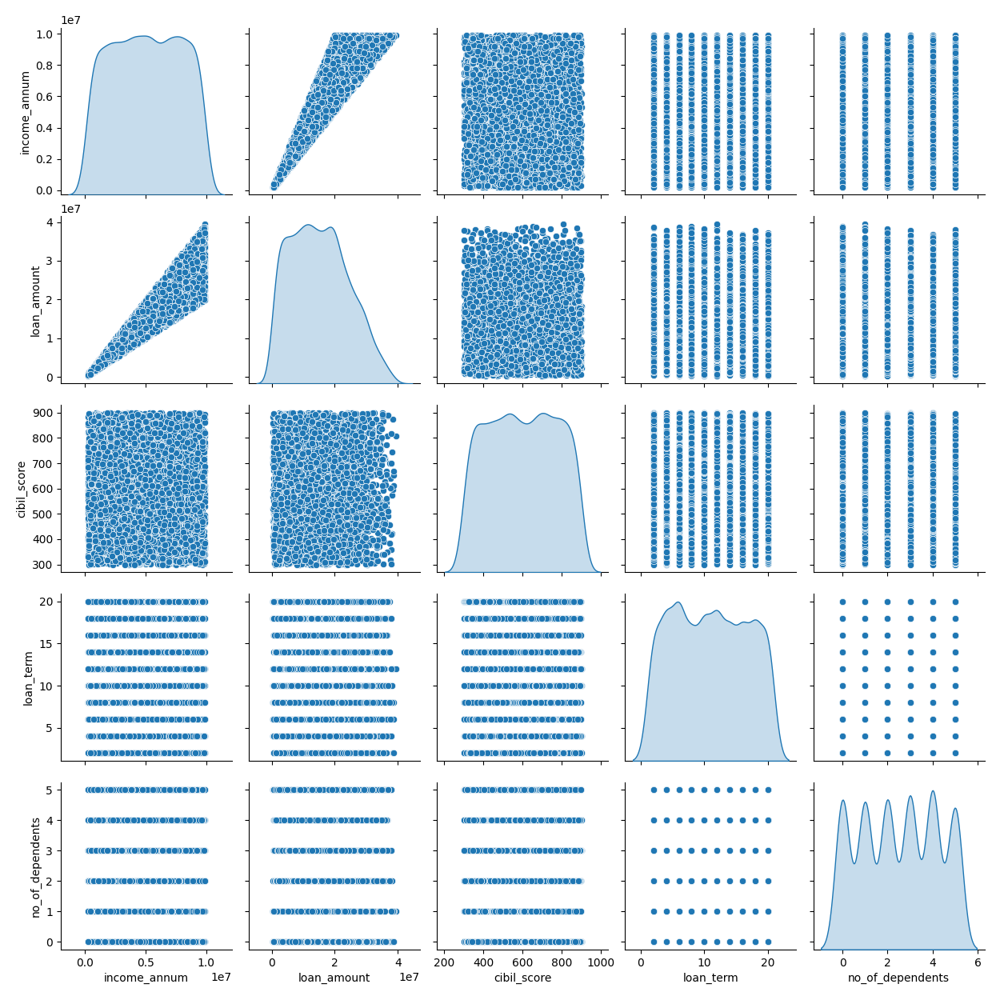
</p>

---

## 🚀 Model Used: XGBoost
To build a high-performing model, we utilized **XGBoost**, an optimized gradient boosting algorithm known for its efficiency and predictive power. Feature selection was guided by gain-based and SHAP-based importance scores.

### 🎯 Final Model Performance:
- **Mean Cross-Validation Accuracy (Augmented Data):** 0.9960
- **Final Model R² Score:** 0.9925
- **Mean Squared Error (MSE):** 0.0019
- **Mean Absolute Error (MAE):** 0.0019

These scores indicate an **extremely accurate model** with minimal prediction errors.

---

## 🔥 Feature Importance Analysis
Understanding **which factors impact loan approvals the most** is crucial. We analyzed feature importance using two techniques:

### 1️⃣ Gain-Based Feature Importance
- **CIBIL Score** is the dominant predictor, contributing the most to decision-making.
- **Loan Term & Loan-to-Income Ratio** are also critical factors.
- **Immovable Assets & Dependents Adjusted Income** have minor but noticeable influence.

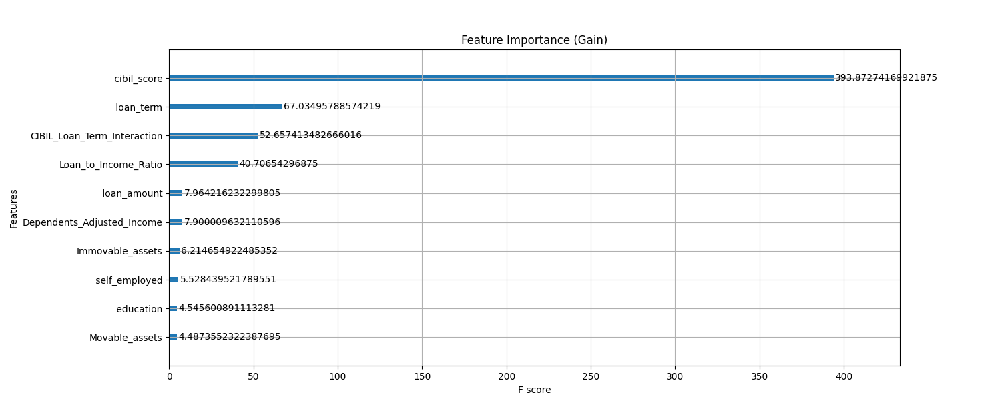

### 2️⃣ SHAP Value Impact
- **SHAP values** provide an intuitive understanding of how individual features affect predictions.
- CIBIL Score and Loan Term show the highest **positive impact** on approvals.
- Higher Loan-to-Income Ratios negatively impact approvals.
- **Feature interaction effects** are evident in CIBIL & Loan Term combinations.

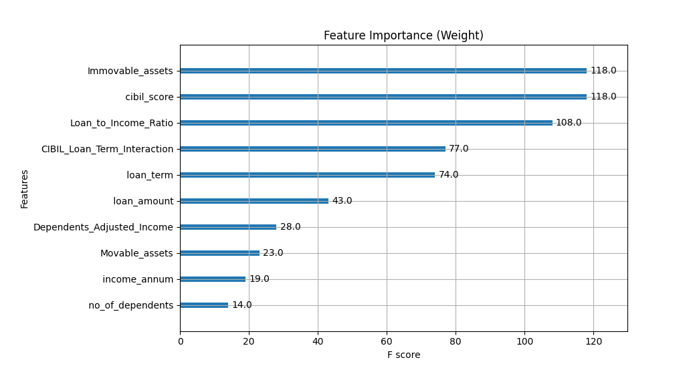
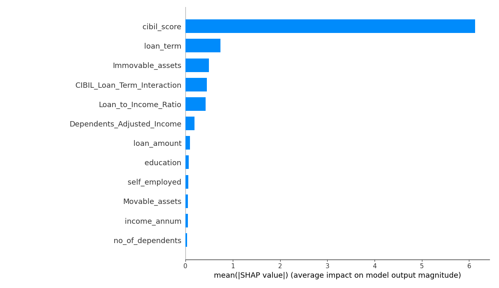
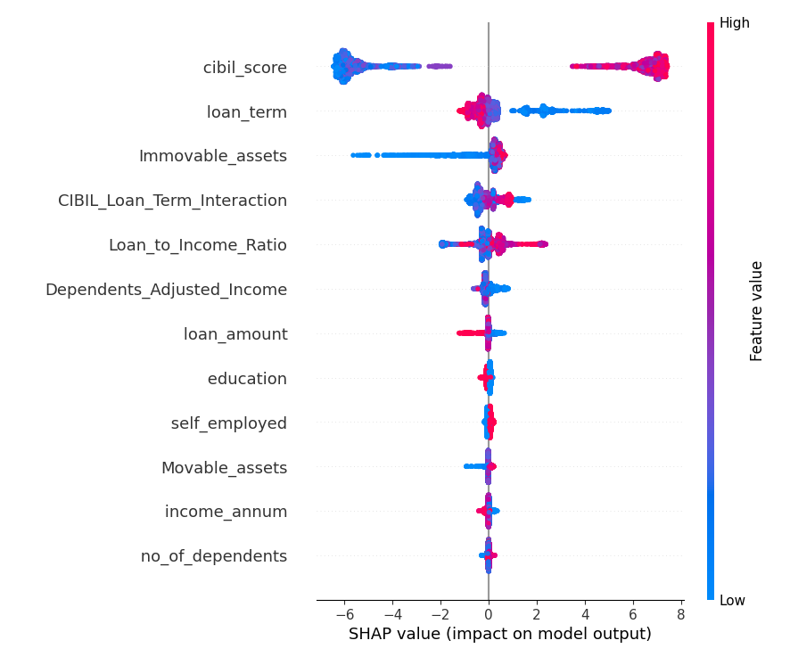

---

## 🛠️ How to Run This Project?
To replicate the results, follow these steps:

### 1️⃣ Clone the Repository
```bash
git clone https://github.com/DhruvSTrivedi/loan_approval_prediction
cd loan-approval-prediction
```

### 2️⃣ Install Dependencies
Ensure you have Python and the required libraries installed:
```bash
pip install -r requirements.txt
```

### 3️⃣ Run EDA Analysis
```bash
python EDA.py
```
This will generate **EDA visuals** in the `EDA_Visuals` folder.

### 4️⃣ Train the Model
```bash
python mix_XGBoost.py
```
This will train the **XGBoost model** and display key performance metrics.

### 5️⃣ Evaluate Predictions
Results, including **feature importance and SHAP values**, will be saved as **images** in the output directory.

---

## 📌 Project Structure
```
├── EDA.py                    # Exploratory Data Analysis Script
├── mix_XGBoost.py            # XGBoost Model Training Script
├── feature_importance_gain.png  # Gain-Based Feature Importance
├── Feature_importance.png     # Overall Feature Importance
├── mean_shap_impact.png       # SHAP Value Mean Impact
├── shap_value_impact.png      # SHAP Summary Plot
├── README.md                 # Project Documentation
```

---

## 🎯 Future Improvements
- Incorporate **deep learning models** (e.g., Neural Networks) for comparison.
- Experiment with **ensemble models** (Stacking & Blending) for enhanced accuracy.
- Optimize hyperparameters further for **even better generalization**.

---

## 🤝 Contributing
Contributions are welcome! Feel free to **fork** the repo and submit PRs.

---

## 📜 License
This project is licensed under the **MIT License**.

📌 _Happy Coding! 🚀_

